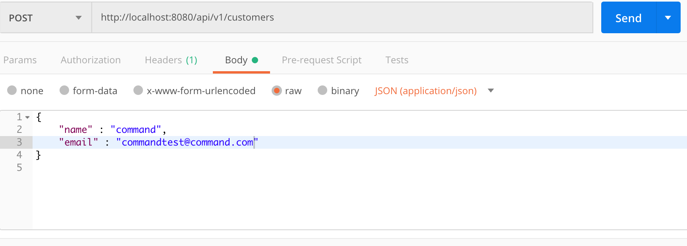

# Command Handler 만들기

해당 섹션의 소스코드 위치는 https://github.com/2blikeCaesar/axon.git 이며

branch는 1-commandhandler 입니다.

CQRS에서 Command를 처리하기 위해서는 CommandHandler가 필요합니다.

이러한 Command들을 처리하기 위한 CommandHandler로 보내기 위해서는 CommandBus가 필요합니다.

## 1. pom.xml 추가

axon 프레임워크를 사용하기 위해서 필요한 디펜던시를 추가해야 합니다.

~~~xml
<dependency>
   <groupId>org.axonframework</groupId>
   <artifactId>axon-spring-boot-starter</artifactId>
   <version>4.0.3</version>
</dependency>

<dependency>
   <groupId>org.axonframework</groupId>
   <artifactId>axon-core</artifactId>
   <version>4.0-M2</version>
</dependency>

<dependency>
    <groupId>org.projectlombok</groupId>
    <artifactId>lombok</artifactId>
    <version>1.18.4</version>
</dependency>
~~~

* axon-spring-boot-starter - spring boot starter에서 axon 프레임워크를 쉽게 사용하기 위한 라이브러리

* axon-core - axon 프레임워크의 core 라이브러리

* lombok - 편집기와 빌드 도구에 자동으로 연결되는 라이브러리로 클래스에 필요한 메소드(생성자, getter, setter)를 어노테이션으로 대체 가능하게 만들어 줌

## 2. Command 생성

~~~java
import lombok.AllArgsConstructor;
import lombok.Getter;
import lombok.Setter;

@AllArgsConstructor
@Getter
@Setter
public class CreateCustomerCommand {
    private String name;
    private String email;
}
~~~

Customer 생성시 name, email이 포함된 명령(command)를 보내게 됩니다.

일반적인 오브젝트 객체와 크게 다르지 않습니다.

## 3. CommandHandler 생성

위에서 생성한 Command를 처리하기 위한 CommandHandler를 생성합니다.

~~~java
import com.sds.customer.command.CreateCustomerCommand;
import org.axonframework.commandhandling.CommandHandler;
import org.springframework.stereotype.Component;

@Component
public class CreateCustomerCommandHandler {

    @CommandHandler
    public void handle(CreateCustomerCommand createCustomerCommand) {
        System.out.println("Name : " + createCustomerCommand.getName() + " Email : " + createCustomerCommand.getEmail());
    }
}
~~~

@CommandHandler 어노테이션으로 handle이란 메소드가 위에서 생성한 CreateCustomerCommand를 처리하도록 정의합니다.

위에서 생성한 Command는 메시지 전달자입니다.

CommandHandler는 Command의 메시지를 기반으로 작동하는 구성 요소입니다.

Axon에서는 두 가지 방법으로 CommandHandler를 만들 수 있습니다.

* CommandHandler 인터페이스를 구현합니다.

* Spring의 경우 @CommandHandler 어노테이션을 지정하여 작성합니다.

## 4. CommandBus 구성

CommandBus는 각각의 Command를 CommandHandler로 라우팅하는 요소입니다.

Axon에서는 아래와 같이 몇 개의 CommandBus가 제공 됩니다.

* SimpleCommandBus

* DisruptorCommandBus

* AsynchronousCommandBus

* RecordingCommandBus

현재 Spring Boot에서 작업을 하기 때문에 CommandBus를 Bean으로 구성하도록 하겠습니다.

~~~java
@Configuration
public class AxonConfig {
    @Bean
    public SimpleCommandBus simpleCommandBus() {
        SimpleCommandBus simpleCommandBus = new SimpleCommandBus.Builder().build();
        return simpleCommandBus;
    }
}
~~~

만약 CommandHandler 인터페이스를 직접 구현한 경우라면
SimpleCommandBus의 subscribe 메소드에 Command와 CommandHandler를 추가해줘야 하지만 현재 어노테이션 기반으로 구성을 하기 때문에 아래와 같은 설정을 추가합니다.

~~~java

@Configuration
public class AxonConfig {
    ..
    ..
    ..

    @Bean
    public AnnotationCommandHandlerBeanPostProcessor annotationCommandHandlerBeanPostProcessor() {
        AnnotationCommandHandlerBeanPostProcessor annotationCommandHandlerBeanPostProcessor = new AnnotationCommandHandlerBeanPostProcessor();
        return annotationCommandHandlerBeanPostProcessor;
    }

}
~~~

AnnotationCommandHandlerBeanPostProcessor Bean을 추가함으로써 @CommandHandler 어노테이션이 있는 빈을 찾아서 CommandBus에 등록하게 해줍니다.

## 5. CommandGateway 구성

CommandBus를 직접 사용하여 Command를 CommandHandler에 직접 보낼 수 있지만 CommandGateway를 사용하게 되면 조금 더 편하게 전달 할 수 있습니다.

Axon의 경우 DefaultCommandGateway를 CommandGateway의 구현체로 제공해주고 있습니다.

따라서 아래 처럼 DefaultCommandGateway를 빈으로 등록해 줍니다.

~~~java
@Configuration
public class AxonConfig {
    ..
    ..
    ..

    @Bean
    public CommandGateway defaultCommandGateway() {
        return DefaultCommandGateway.builder().commandBus(simpleCommandBus()).build();
    }
}
~~~

## 6. Controller 작성 및 호출

~~~java
@RestController
@RequestMapping(value = API_V1_BASE_PATH + "/customers", produces = MediaType.APPLICATION_JSON_VALUE)
public class CustomerController {

    @Autowired
    private CommandGateway commandGateway;

    @PostMapping
    public void createCustomer(@RequestBody CustomerDTO customerDTO) {
        CreateCustomerCommand createCustomerCommand = new CreateCustomerCommand(customerDTO.getName(), customerDTO.getEmail());
        commandGateway.send(createCustomerCommand);
    }
}
~~~

위와 같이 CustomerController를 작성하고 createCustomer 메소드를 작성합니다.

이후 서버를 실행 시킨 이후 PostMan과 같은 툴을 통하여 아래처럼 호출을 합니다.

콘솔에서 CommandHandler에서 작성한 출력문이 실행 된 것을 확인 할 수 있습니다.

## 7. 참고

http://www.geekabyte.io/2015/10/exploring-cqrs-with-axon-framework.html
